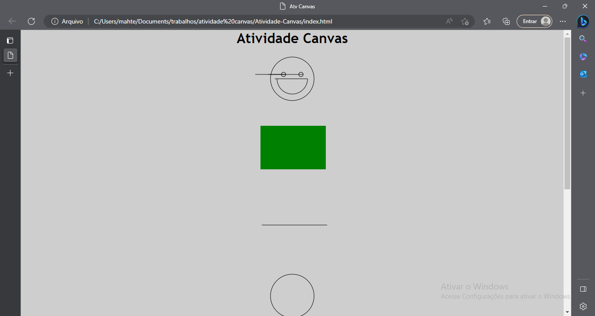
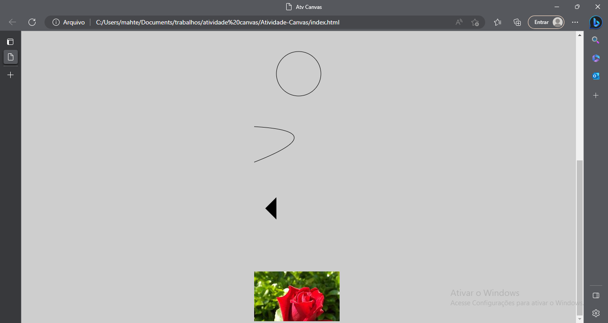

README.md do repositório Atividade-Canvas

Criação do arquivo HTML
    Configuração do idioma do HTML
    Configuração do cabeçalho (head)
        O comando (title) define o título do site ("Atv Canvas")
        O comando (meta charset) define a leitura de caracteres especiais
        O comando (meta name="viewport") define a escala do site
        O comando (meta name="description") define a descrição do site com o título e data da criação
        O comando (link rel="stylesheet" href="css/style.css"/) conecta o HTML com o arquivo "style.css"
        O comando (link rel="shortcut icon" href="img/icon.png"/) coloca um ícone no site do arquivo
    Finalização do cabeçalho (head)
    Configuração do corpo (body)
        O comando (h1) é usado para exibir o título "Atividade Canvas"
        Os comandos (div) criam divisórias para conter o comando (canvas)
        Os comandos (canvas) definem o canvas, cada um contendo uma forma diferente
        O comando (script src="js/script.js") conecta o HTML com o arquivo "script.js"
    Finalização do corpo (body)
Finalização do arquivo HTML (html)
Criação do arquivo CSS
    O comando margin define a margem dos quatro lados do elemento
    O comando padding define a margem entre o conteúdo dos elementos e suas bordas
    O comando text-align centraliza os elementos da página
    O comando background muda a cor do fundo da página usando RGB para um tom de cinza
    O comando font-family muda a fonte dos itens da página para Trebuchet MS
Finalização do arquivo CSS
Criação do arquivo JS
    Os comandos const definem constantes, as constantes noemadas como "canvas" ligam com o HTML e são usadas para a criação das constantes "ctx", que são usadas para fazer as formas
    Os comandos (getElementById) buscam os elementos pelo id para definição das constantes
    Os comandos (getContext) definem a renderização do elemento, sendo esta definida como 2d
    O comando (beginPath) inicia os traços das formas
    O comando (arc) define a posição e o ângulo do círculo e da curva
    O comanod (moveTo) muda as coordenadas do ponto inicial da figura
    O comando (stroke) tira a cor das formas, deixando apenas as bordas
    O comando (fillRect) cria o retângulo com as coordenadas de cada ponto em x e y
    O comando (fillStyle) define a cor do retângulo como verde
Finalização do arquivo JS

Prints da página: 

